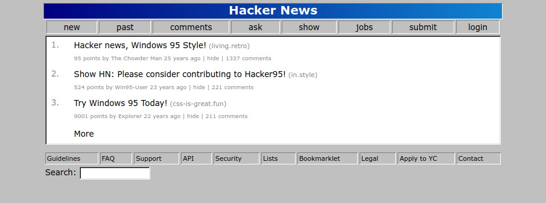

# Hacker95 - Style Hacker News like its Windows 95

Hacker95 is a CSS stylesheet that styles Hacker News into a Windows 95/98 styled theme.

## Installation

Method of installation will differ depending on which browser you are using. First download Hacker95 and unzip the CSS file from the folder:

* [Hacker95](https://github.com/chowderman/Hacker95/releases/download/1338/hacker95.css.zip)

#### Firefox

For firefox, you'll need to add all the CSS code to your `userContent.css` file:

1. Open a new tab in Firefox
1. Type `about:support` in the URL bar
1. Click the button named `Open Profile`
1. In the window that opens up, open the `chrome` folder (if none exists, make this folder)
1. Add all the CSS code from hacker95.css to the `userContent.css` file (if it doesn't exist, create this file)
1. Open a new tab in Firefox and type `about:config` in the URL bar
1. Click Accept
1. In the search bar search for `toolkit.legacyUserProfileCustomizations.stylesheets` and set this value to `true` (double clicking the row will toggle this between true and false)
1. Restart the browser, and check out Hacker News

#### Chrome

To be determined. If someone has experience with this please pull request.

#### Edge

To be determined. If someone has experience with this please pull request.

#### Safari

To be determined. If someone has experience with this please pull request.

## License

The Unlicense, courtesy of Chowder Man
